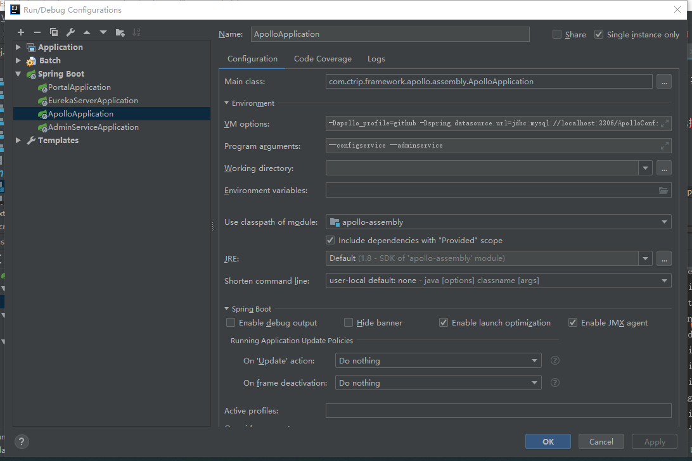
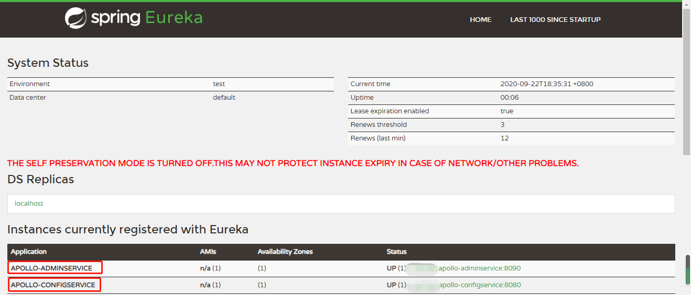
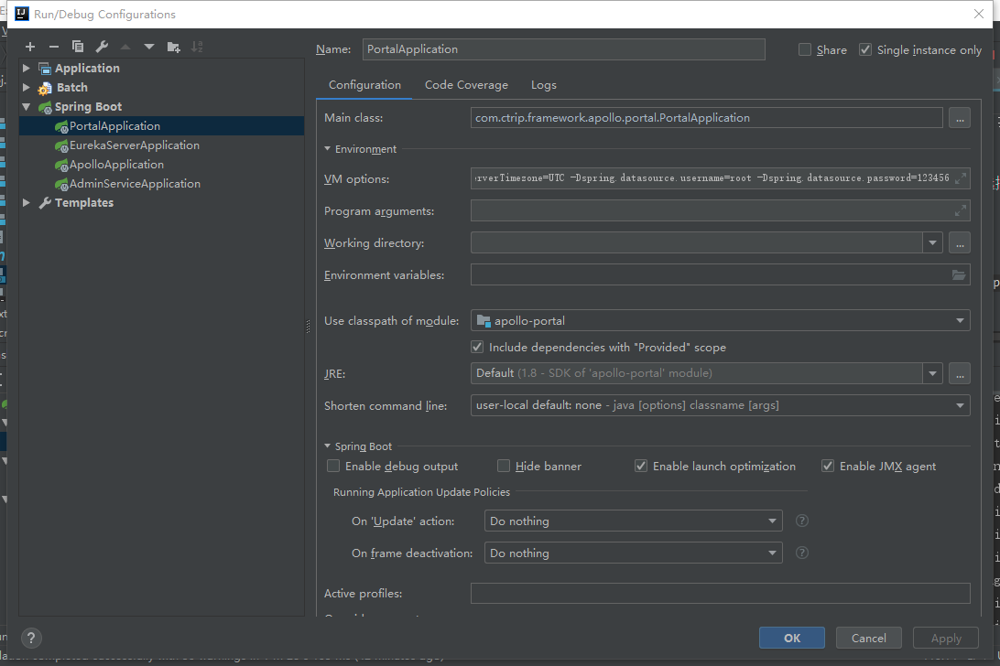
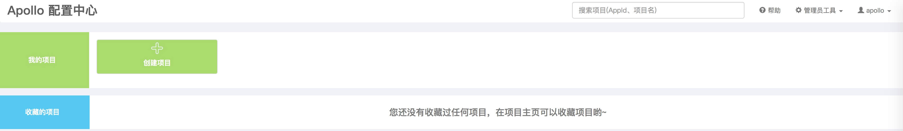

# 微服务统一开放平台
基于微服务架构思想、容器技术打造的一款微服务统一开放平台，帮助用户快速开发、搭建微服务项目，为个人、中小型企业提供易接入、易维护、易治理的微服务平台。
* 微服务治理：服务注册/发现、服务治理、动态配置管理、服务监控、调用链路追踪等能力。
* API网关：对外提供统一的入口，具备身份验证、API鉴权、监控统计、动态路由、限流限速、负载均衡、熔断、API测试等能力。
* 容器部署：采用docker方式部署，易于弹性扩容，降低测试、生产等部署的成本，为部署的安全、管理保驾护航。
* 统一管理平台：拥有在线代码生成、调试、接口文档管理、服务治理类（如：服务监控、调用链路追踪等）、动态接入路由配置、服务部署等于一体的管理平台，便于开发、测试、运维的使用。

# 开发手册
## 项目结构
基于Spring Boot框架，采用maven module方式分层、模块化创建项目结构，便于后期的基础框架版本升级/拆分、各模块的并行开发。  
项目名称暂定为**xcloud**，称之为**微服务统一开放平台**。项目工程结构如下：
```
xcloud
    |--- xcloud-common         公共模块
            |--- xcloud-common-core            核心公共包(工具类、常量类等)
            |--- xcloud-common-exception       异常处理
    |--- xcloud-registry       注册中心
            |--- xcloud-registry-eureka        注册中心-Eureka
            | …… 
    |--- xcloud-config         配置中心
            |--- xcloud-config-apollo       Apollo配置中心
            | ……
    |--- xcloud-access         前置接入层
            |--- xcloud-access-nginx        前置代理
            |--- xcloud-access-gateway      API网关
            | ……
    |--- xcloud-management     管理模块
            |--- xcloud-management-platform 统一管理平台
            |--- xcloud-management-ui       统一管理平台前端
            | ……
    |--- xcloud-middleware      中间件
            |--- xcloud-middleware-mysql    MySql
            |--- xcloud-middleware-redis    Redis
            | ……
    
```

## 开发规范
### 模块结构规范
以API网关xcloud-access-gateway为例说明，模块结构规范如下：  
```
xcloud-access-gateway
    |- src      源码目录
        |- main 源文件
            |- java java源代码目录
                |- com
                    |- xcbeyond
                        |- cloud
                            |- access
                                |- gateway      包路径
                                    |- controller       控制层，对外提供api接口层
                                    |- mapper           mapper层，定义数据库表操作层
                                    |- model            model层，定义数据库表对象
                                    |- entity           entity层，定义实体类
                                    |- service			service层
                                        |- impl             service实现层
                                    |- GatewayApplication.java	模块启动类
            |- resources	资源配置文件目录
            |- docker		Dockerfile文件目录
        |- test				单元测试源文件
    |- .gitignore   		git忽略文件配置
    |- pom.xml				maven依赖配置文件
```

### 编码规范
#### 包（package）规范
所有的包名以com.xcbeyond.xcloud作为开头，后续为具体的模块名、子模块名、功能名等，如：com.xcbeyond.xcloud.access.gateway.service
#### 类（Class）规范
类名是一个名词或名词组合，采用大小写混合的方式，每个单词的首字母大写。尽量使你的类名简洁而富于描述含义。使用完整单词，避免缩写词(除非该缩写词被更广泛使用，像URL，HTML)。
#### 接口(Interfaces)规范
大小写规则与类名相似，在每个接口前加一个字母I，与类进行区别。实现类，则去掉前缀字母I，并加后缀impl。
#### 方法(Methods)规范
方法名是一个动词，采用大小写混合的方式，第一个单词的首字母小写，其后单词的首字母大写。
#### controller层规范
N/A。
#### mapper层规范
* 命名规范：表名首字母大写+Mapper后缀。
* mapper中SQL尽量采用单表操作。
#### model层规范
* 用于定义与数据库表对应的JavaBean。
* 命名规范：表名首字母大写。
#### service层规范
* 命名规范：表名首字大写+Service后缀，或功能名+Service后缀。
* service中方法参数，禁止使用Map类型，使用自定义Bean(如：model、entity层)。

## 技术选型
### 前端技术
N/A。

### 后端技术  

| 技术框架 | 名称 | 版本 | 官方资料 |
| --- | --- | --- | --- |
| Spring Boot | 基础框架 | 2.2.0.RELEASE | https://spring.io/projects/spring-boot |
| Spring Cloud | 微服务治理框架 | Greenwich.SR3 | https://spring.io/projects/spring-cloud |
| Apollo | 携程分布式配置中心 | 1.7.1 | https://github.com/ctripcorp/apollo |

## 环境搭建&部署
### 调试环境搭建
#### xcloud-config-apollo
1. 创建数据库

Apollo服务端共有两个数据库：
* ApolloPortalDB
* ApolloConfigDB

在项目`xcloud\xcloud-config\xcloud-config-apollo\scripts`目录下，提供了对应的初始化SQL脚本`apolloconfigdb.sql`、`apolloportaldb.sql`。

通过各种MySQL客户端分别导入两个SQL脚本。（可根据个人喜好选择MySQL客户端，如：Navicat、IDEA 数据库插件等）

2. 启动ConfigService&&AdminService

同时启动`apollo-configservice`和`apollo-adminservice`项目，基于`apollo-assembly`项目启动。

1）IDEA配置。



* Main class：`com.ctrip.framework.apollo.assembly.ApolloApplication`

* VM options：

  > -Dapollo_profile=github
  > -Dspring.datasource.url=jdbc:mysql://localhost:3306/ApolloConfigDB?characterEncoding=utf8&serverTimezone=UTC
  > -Dspring.datasource.username=root
  > -Dspring.datasource.password=123456

* Program arguments：`--configservice --adminservice`
* Use classpath of module：`apollo-assembly`

2）启动`apollo-assembly`项目。

启动时间较慢，请耐心等待。（启动开始会有一些错误，请忽略！）

能打开`http://127.0.0.1:8080/`，并发现`APOLLO-ADMINSERVICE`、`APOLLO-CONFIGSERVICE`已注册到Eureka中，则代表启动成功。



3. 启动PortalService

1）IDEA配置。



* Main class：`com.ctrip.framework.apollo.portal.PortalApplication`

* VM options：

  > -Dapollo_profile=github,auth  
  > -Ddev_meta=http://localhost:8080/  
  > -Dserver.port=8070  
  > -Dspring.datasource.url=jdbc:mysql://localhost:3306/ApolloPortalDB?characterEncoding=utf8&serverTimezone=UTC  
  > -Dspring.datasource.username=root  
  > -Dspring.datasource.password=123456  

* Use classpath of module：`apollo-portal`

2）启动`apollo-portal`项目。

打开`http://127.0.0.1:8070/`，登录进入Apollo配置中心。

> 内置账号：
>
> ​	username：Apollo
>
> ​	password：admin



